# DSA课程内容doc-期末

## 6 图论

- 树plus（？），树可以看做是没有环路的图

### 6.0 概念

- $G=(V, E)$，V为顶点集，E为边集
- 子图
- 生成子图：由$G'=(V, E'\subseteq E), E'$为生成子图
- 简单图：无自环，无重边
- 完全图
- 多重图：有多重边
- 有向图/无向图
- 对于有向边：$i\to j$中，i是弧尾，j是弧头
- 稀疏图：$e<n\log_2n$
- 简单路径：没有重复顶点
- 无向图的连通性：
  - 连通分量：极大连通子图
  - 极小连通子图：最小生成树
- 有向图的连通性：
  - 强连通性：任意两点存在双向路径
  - 强连通分量：极大连通子图
  - 生成森林
- 割边（桥）/割点（关节点）

- 度
  - 无向图
    - 顶点的度之和为边的两倍
  - 有向图
    - 分出度和入度，且出度之和=入度之和，其余和无向图一致
- 路径/回路
- 哈密顿路径/回路：每个点经过一次
- 欧拉路径/回路：每条边经过一次
  - 定理：含有至少2个顶点的多重连通图具有欧拉回路，当且仅当，它的每个顶点的度都为偶数
  - 定理：一个多重连通图具有欧拉路径但没有欧拉回路，当且仅当，它恰好有2个度为奇数的顶点
  - 定理：一个有向图存在欧拉回路的充要条件是该图必须是强连通的且每一个顶点有相同的入度和出度


### 6.1 存储

#### 6.1.0 邻接矩阵

- `a[i][j] = w`表示 $i\to j 有一条边，且权重为w$

#### 6.1.1 邻接表

- 维护一个头指针数组`headvex`，`headvex[i]`表示第i个节点
- 每个头指针节点维护一个单链表，表示邻接点信息
- 分正邻接表（维护出度），逆邻接表（维护入度）

#### 6.1.2 十字链表

```c++
struct node{
    int tailvex;
    int headvex;
    node *tlink; // 弧尾方向
    node *hlink; // 弧头方向
    int info; // 存权重等
};
struct headNode{
    int data;
    node *firstin, *firstout;
};
```

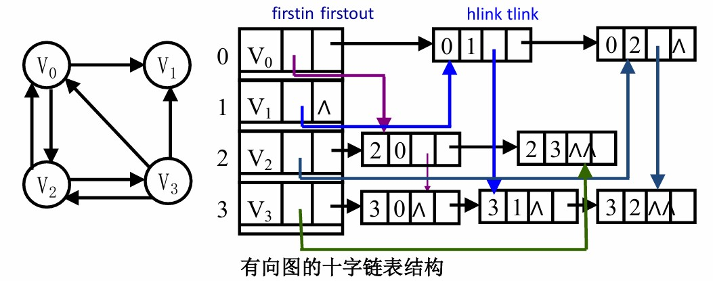

- 同时维护**有向图**的入度和出度，可以看做被融合的正邻接表和逆邻接表

- 由上述定义可知：


  - 每个边节点（node），存储边的所有信息，维护出、入信息


  - 每个点节点（headNode），存储编号，以及第一条出边、入边的指针


  - 沿着$firstin\to hlink$维护逆邻接表，读边的`tailvex`
  - 沿着$firstout\to tlink$维护正邻接表，读`headvex`

  - **画图方法**：
    - 先画一张正邻接表，补全`firstout、tlink`
    - 在该表中按照逆邻接表的画法连接`firstin、hlink`
  - 代码实现为头插法，参考邻接多重表的示例代码

#### 6.1.3 邻接多重表

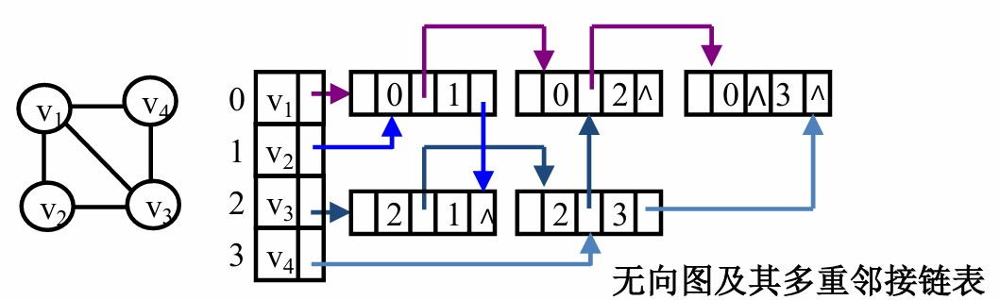
```c++
struct node{
	int info;
    int mark; // 标记该边是否被遍历
    node *ilink, *jlink;
    int ivex, jvex;
};
struct headNode{
    int data;
    node *firstedge;
};
```


  - 维护无向图的边关系
  - 在普通邻接表中，无向图的每条边需要两个节点表示，冗余！邻接多重表只需要一个节点
  - 由结构体定义可知节点的构造，可以类比十字链表，只是对于无向边不对两个顶点加以区分，用i/j代指
- 同一张图的邻接多重表有**多种画法**！

- **如何画图**？（见下图，这是例题的另一种画法）
  1. 将无向边`(ivex, jvex)`列出，不妨取$ivex<jvex$
  2. 将ivex视作“弧头”，画正邻接表，此时0号节点的每条边都被正确相连
  3. 对后续的每一个顶点：遍历所有边，顺次相连（可以是图中最好连线的方式来画），注意ilink和jlink即可
  4. 高度建议画完之后检查一遍所有顶点是不是都可以遍历关联边
- 头插法维护

```c++
// 邻接多重表建表代码
for(int k=1; k<=n; ++k){
	scanf("%d%d", &i, &j); // 假设i<j
  	p = new node;
  	p->ivex = i, p->jvex = j;
  	p->ilink = head[ivex].firstedge, p->jlink = head[jvex].firstedge;
  	head[ivex].firstedge = p, head[jvex].firstedge = p;
}
// 遍历某个顶点的邻接点
p = head[vex].firstedge;
while(p){
    if(p->ivex == vex){
        printf("%d ", p->jvex);
        p = p->ilink;
    }else if(p->jvex == vex){
        printf("%d ", p->ivex);
        p = p->jlink;
    }
}
```

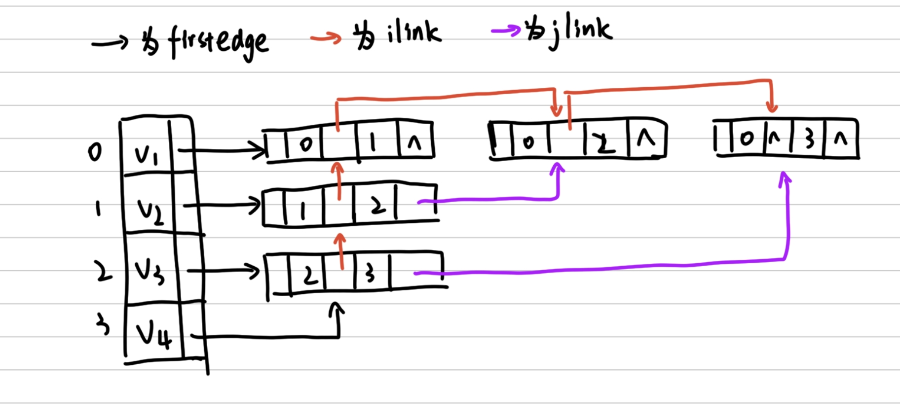

### 6.2 遍历

- DFS
  - 数据结构为栈或者队列
  - 前序：调用DFS之前压入队列
    - 求顶点路径
  - 后序：调用DFS之后压入队列
  - 逆前序：调用DFS之前压入栈
  - 逆后序：调用DFS之后压入栈
    - 拓扑排序
  
  ```c++
  void dfs(int cur){
      for(int i=1; i<=next_state[cur]; ++i){
          vis[cur] = 1;
          nxt = state[cur][i];
          if(!vis[nxt]){
              dfs(nxt);
          }
          vst[cur] = 0; // 回溯
      }
  }
  ```
  
- BFS

  - 使用队列
  - 类似树的层次遍历
  - 对于每条边平权的情况下，找出来的第一条一定是最优路径

  ```c++
  // q为队列
  while(!q.empty()){
      vis[cur] = 1;
  	int cur = q.head();
      q.pop();
      for(int i=1; i<=nxt_state[cur]; ++i){
          int nxt = state[cur][i];
          if(!vis[nxt]){
              q.push(nxt);
          }
      }
  }
  ```

- 拓扑排序

  - 由一个偏序关系得到集合上的全序的操作
  - **无环图**才可以拓扑！拓扑排序本身就可以判断是否存在环
  - 手算拓扑序列，Kahn更简单

  ```c++
  // Kahn的拓扑，如果ans!=n，则有环；需要输出拓扑序列，每找到一个入度为0的点存一下就行
  int topo(vector<vector<int> > g, int indeg[], int n){
      int ans = 0;
      int u;
      int is_indeg_zero;
      do{
          u = -1;
          is_indeg_zero = 0;
          for(int i=1; i<=n; ++i){
              if(indeg[i] == 0){
                  indeg[i] = -1;
                  u = i;
                  is_indeg_zero = 1;
                  ans++;
                  break;
              }
          }
          if(u != -1){
              for(int i=0; i<g[u].size(); ++i){
                  indeg[g[u][i]]--;
              }
          }
      }while(is_indeg_zero);
      return ans;
  }
  ```

  ```c++
  // DFS逆后序求拓扑
  bool dfs(int u, const vector<vector<int>>& g, vector<int>& color, stack<int>& st) {
      color[u] = 1; // 标记为 1 (正在访问，处于递归调用栈中)
      // 遍历当前节点的所有出边 (邻接点)
      for (int i = 0; i < g[u].size(); ++i) {
          int v = g[u][i];
          if (color[v] == 1) {
              // 发现指向“正在访问”节点的边，说明存在回边 (环)！
              return false; 
          } else if (color[v] == 0) {
              // 遇到未访问的节点，继续深入 DFS
              if (!dfs(v, g, color, st)) {
                  return false; // 如果子树中发现环，层层向上报错
              }
          }
          // 如果 color[v] == 2 (已访问)，说明那是另一个已经处理完的分支，直接跳过即可
      }
      color[u] = 2; // 当前节点的所有邻接点都处理完毕，标记为 2 (已访问)
      // 【核心操作】：在节点彻底访问完毕之时，将其压入栈中 (这就是后序压栈)
      st.push(u); 
      return true;
  }
  
  // 外部调用的主控函数
  vector<int> topoDFS(const vector<vector<int>>& g, int n) {
      vector<int> color(n + 1, 0); // 状态数组：初始化为 0 (未访问)。假设节点编号 1~n
      stack<int> st;               // 用于存放后序序列的栈
      vector<int> result;          // 最终的拓扑排序结果
      // 图可能不是强连通的，存在多个独立的连通块，因此需要遍历所有节点作为起点尝试
      for (int i = 1; i <= n; ++i) {
          if (color[i] == 0) {
              if (!dfs(i, g, color, st)) {
                  return {}; // 返回空数组，表示检测到环，无法进行拓扑排序
              }
          }
      }
      // 逆后序输出：将后序压入的节点依次出栈，即为正向的拓扑排序
      while (!st.empty()) {
          result.push_back(st.top());
          st.pop();
      }
      return result;
  }
  ```

### 6.3 连通性

#### 6.3.0 无向图的连通性

- DFS生成树/生成森林
  - 树上的边是被dfs访问的边，即：点被标记后无法访问的边为回边，不在生成树中
- BFS生成树：类比DFS生成树
- 一般的，图用邻接表存，树/森林用孩子-兄弟链表

#### 6.3.1 有向图的强连通性

##### 6.3.1.0 Kosaraju

- 正图dfs一次，逆图dfs一次，两个图的强连通分量相同
- 逆图：将$G$的所有边反向得到$G'$
- 算法步骤：
  - 对$G$进行DFS，求所有顶点的逆后序编号（退出dfs的顺序，即拓扑排序）
  - 根据上一步中得到的编号，**从大到小**，对$G'$的点dfs，每一轮dfs得到的所有点归为一个集合，为一个强连通分量
  - $G'$每结束一轮dfs，保存一个强连通分量，寻找编号最大且未被访问的点开始新一轮dfs
  - 直到所有点均被访问
- 考虑使用**十字链表**存图，同时维护原图和逆图的正邻接关系（原图的逆邻接就是逆图的正邻接）；dfs维护一个**栈**来存逆后序点序列，即最后退出的点在栈顶
- ==证明==：若逆图有$s\to v$，则原图上s、v强连通
  - 逆图dfs到$s\to v$的路径，则s的编号大于v，s比v后退出原图dfs
  - 有两种情况：
    1. $dfs(s)_{st}\to dfs(v)_{st} \to dfs(v)_{ed}\to dfs(s)_{ed}$
    2. $dfs(v)_{st}\to dfs(v)_{ed}\to dfs(s)_{st}\to dfs(s)_{ed}$
  - 因为逆图有$s\to v$，所以原图一定有$v\to s$的路径，第二种情况不成立
  - 第一种情况意味着原图有$s\to v$的边
  - 所以s、v强连通

##### 6.3.1.1 tarjan

- 只用掌握求割点（关节点）的办法

- 已知dfs生成树，如何判别关节点？
  - 如果整棵树的根节点有多个分支，则为关节点
  - 对于非根节点的任意节点v：如果它的子树没有指向v的祖先的回边，则v为关节点
    - 如果存在连接到祖先的回边，则删除v，子孙仍和祖先通过回边连接，即v不是关节点

- 对于每个节点，维护两个变量`visited[v]`和`low[v]`
  - `visited[v]`表示节点i进入dfs的时间戳，即逆前序？
  - `low[v]`表示节点i能通过边回溯到的、时间戳最小的节点
    - 影响`low[v]`有三种：
      1. 子孙通过回边连接到了祖先
      2. 节点i自身通过回边连接到了祖先
      3. 节点i自身的时间戳
    - 因为我们需要能连接到的最早的那个祖先，则`low[v]=min(visited[v], low[w], visited[k])`
      - 其中，w为i的子孙，k为与w通过回边连接的祖先
    - 为什么只考虑回边，不考虑非回边？
      - 计算`visited`数组时的dfs生成了dfs生成树，将所有非回边的计算纳入`visited`内了

- 当`low[w]>=visited[v]`说明什么？

  - 子孙w能回溯到的最近节点也在v以下，则v被删除必然导致w和v的祖先断开，连通分量+1，v为关节点

- 特判！根节点直接判断孩子数量即可

- 代码实现思路：

  - 全局维护`low`，`visited`，`timer`，每个节点维护一个`child_cnt`
  - dfs每访问一个新节点：

  ```c++
  timer = 1;
  void tarjan(int v, int parent){
      int child_cnt = 0;
      visited[v] = timer++, low[v] = visited[v];
      for(遍历v的所有邻接点u){
          if(visited[u] == 0){ // 孩子
              child_cnt++;
              tarjan(u, v); // dfs会算完该孩子的整个子树之后才进入下一步，此时的low[u]已经确定
              low[v] = min(low[v], low[u]);
              if(parent == -1 && child_cnt>=2){
                  is_cut_node[v] = 1;
              }else if(parent!=-1 && low[u]>=visited[v]){
                  is_cut_node[v] = 1;
  			}
          }else if(u == parent){
              continue;
  		}else if(visited[u] != 0){ // 找到一个回边连接的祖先
              low[v] = min(visited[u], low[v]); 
          }
      }
  }
  ```

  - 在整个图上跑这个dfs即可

### 6.4 最小生成树

#### 6.4.0 Prim

- 贪心选择节点，用于**稠密图**，复杂度$O(n^2)$
- 选择**与当前树邻接的、权重最小的边**，整棵树一直保持连通
- 每次添加节点w，贪心策略如下：
  - w和树上已经有的节点v是邻接的
  - $(v,w)$的边权是所有$(v,w')$中最小的
  - 将w添加进最小生成树，cost累加

#### 6.4.1 Kruskal

- 贪心选择边，用于**稀疏图**，复杂度$O(e\log e+n^2)$，可优化至$O(e\log e)$
- 贪心选择**全局最小边权、且还没有连通**的边，是多棵树逐步连通的过程
- 贪心策略：
  - 将边权排序
  - 每次取当前的最小边
  - 维护并查集，判断：$(u,v)$是否在一个等价类中（等价类中元素表示相互连通）
  - 如果不连通，添加该边，cost累计

### 6.5 求关键路径/AOE

- 图中的顶点代表“事件”，边代表“依赖关系”或者“活动”，边权代表“耗时”

- 求从起点到汇点的最长路径

- 求整个工程完成的最短时间（工程中耗时最长的阶段制约了完成速度）

- 假设起点为A，汇点为W

- 定义四个变量：（手算AOE就是依次计算这四个，然后出结果）

  - 对于顶点$U$，定义`ve(U)`为*最早发生时间*，是从**起点**到该顶点的**最长路径长度**

    - `ve(U) = A到U的最长路径长度`

  - 对于顶点$U$，定义`vl(U)`为(不影响工程进度的)最迟发生时间，是从汇点最早发生时间减去该顶点到汇点的最长路径长度

    - `vl(U) = vl(W) - U到W的最长路径长度`
    - `vl(A)=ve(A)=0, vl(W)=ve(W)`

  - 对于边$i=(j, k)$，定义`e(i)`为活动最早开始时间

    - `e(i) = ve(j)`

  - 对于边$i=(j, k)$，定义`l(i)`为活动最迟开始时间
    - `l(i) = vl(k)-w(i)`，w(i)为i的边权
- 所有`e(i)==l(i)`的都是关键路径
- 由上述定义，ve和vl的计算显然对之前的点有依赖性，代码实现时先做拓扑排序，按拓扑正序计算ve，按拓扑逆序计算vl

### 6.6 最短路径

#### 6.6.0 Dijkstra 单源最短路

- 这玩意必须会手算，巨喜欢考，就模拟算法跑n遍结束
  - 如果想考难一点，可以加堆优化（这样很不道德我希望不要这样）
- 核心思想是“松弛”
  - 每次选择已经算出的、还未确定的所有单源路径中，选择最小的那一条，确定之
  - 因为新确定了一条最短路，将这条路径终点作为中转，修改其他未确定路径的代价

```c++
// 邻接矩阵存图
memset(vst, 0, sizeof(vst)); // 初始化vst为0，表示没有确定任何路径
memset(dis, 0x3f, sizeof(dis)); // 初始化路径代价为INF，表示未被计算
dis[st] = 0; // 起始点到自己的距离已知，为0
for(int i=1; i<=n; ++i){
	int min_idx = -1;
    int minn = INF;
    for(int j=1; j<=n; ++j){ // 找未被访问的、路径开销最小的点
        if(!vst[j]){
            if(minn > dis[j]){
                minn = dis[j];
                min_idx = j;
            }
		}
	}
    if(min_idx == -1){ // 不连通
        break;
	}
    vst[min_idx] = 1; // 确定该点的最短路径长度
    for(int j=1; j<=n; ++j){
        if(!vst[j] && dis[j]>dis[min_idx]+g[min_idx][j]){
            dis[j] = dis[min_idx]+g[min_idx][j]; // 松弛！
		}
    }
}
```

#### 6.6.1 Floyd 全源最短路

- 无脑三重循环秒了
- 本质动态规划，看不懂可以死背
  - 最外层k枚举所有中转点
  - 后两层枚举路径的起点和终点
  - 状态转移：如果存在中转点k，使得原本的路径变短，则选择更短的路径

```c++
memset(f, 0x3f, sizeof(f)); // 初始化为INF
for(int i=1; i<=n; ++i){
    f[i][i] = 0;
}
// 输入边权，存入f中
for(int k=1; k<=n; ++k){
    for(int i=1; i<=n; ++i){
        for(int j=1; j<=n; ++j){
            if(f[i][k]+f[k][j] < f[i][j]){
                f[i][j] = f[i][k]+f[k][j];
            }
        }
    }
}
```

---------------

## 7 动态存储管理

- 考虑堆内存的管理方式
- 可利用空间表：将所有可用空间串起来形成一个链表
  - 分配时，从表中选择合适的块分配，并从表中删除
  - 回收时，将回收块插入表
- 空闲块组织方式：
  - 大小相同
  - 大小满足一定规格
  - 大小不确定

### 7.0 三种常见的分配策略

- 假设分配空间大小为n
- 首次拟合法
  - 分配：查表，找第一个比n大的空闲块，分配n的空间，剩余部分仍空闲
  - 回收：插入到表头
- 最佳拟合法
  - 扫描整个表，找大于n且最接近n的块，分配n的空间，剩余部分仍空闲
  - 回收：插入到合适的位置
  - 一般的，为了让查表节省时间，需要维护表的单调增
  - 适用于请求分配的内存块大小范围较广的系统
- 最差拟合法
  - 分配：找最大的那个块来分配
  - 回收：插入到合适位置
  - 维护表单调减
  - 适用于请求分配的内存块的大小范围较窄的系统

### 7.1 边界标识法

- 双重循环链表，pav为指向当前节点的指针
- 每个内存区域的**头部**和**底部**两个边界上分别设置标识
  - 为什么头尾都要标识？
  - 回收块首地址-1为上一个块的尾标识，回收块尾地址+1是下一个块的头标识
  - 易于判别在物理位置上与其相邻的内存区域是否为空闲块，以便于将**所有地址连续的空闲存储区**合并成一个尽可能大的空闲块
- 块结构如下图：
  - llink、rlink：构成空闲块的双重循环链表的指针
  - tag：是否空闲
  - size：空闲块大小
  - uplink：从当前块的foot指向head，便于快速修改合并之后的head标签

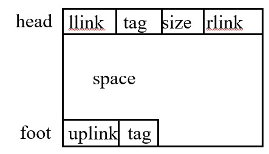

- 分配：
  - 约定1：选定常量e作为最小内存碎片大小，即当分配块大小为m，需分配空间为n时：
    - $m-n\leq e$，分配整个块
    - $m-n>e$，分配n，剩余空间保持空闲
  - 约定2：从上次分配节点的后继节点开始查表，即pav不会每次都从表头开始
  - 可以使用**首次拟合法**来分配
  - 每次分配时返回**头地址**，即返回块m的首地址，将原块m的第$n$个地址作为新空闲块的首地址
- 回收：
  - 注意把相邻的空闲块合并起来
  - 如果可以合并，则直接在合并块的位置修改标识；如果不可以合并，插入到pav后面
- **画图注意事项**：
  - 分配时：首次拟合，pav结束位置为分配节点的后继
  - 回收时：
    - 如果不需要合并，空闲块插入在pav的前或后，pav指向这个块
    - 如果合并，合并结束后，pav指向合并块

### 7.2 伙伴系统

- 空闲块大小符合规格$2^k$
- 图示如下：
  - 由一个数组形成的表头组织
  - 每个子表为一张可用空间表，双重循环链表，保存所有大小一致的空闲块

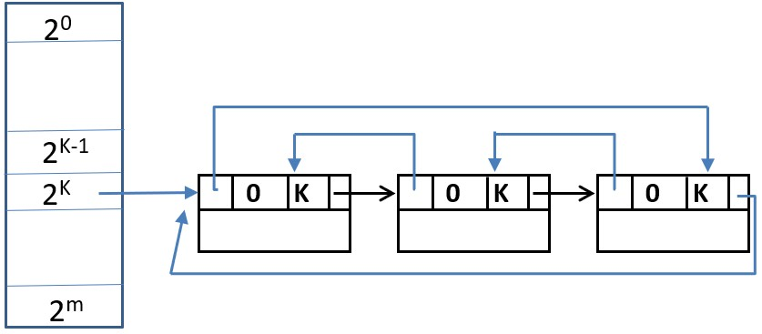

- 分配：
  - 优先查找恰好可以分配的，即$2^{k-1}<n\leq 2^k-1$，第k+1张子表有空闲节点，分配一个大小为$2^k$的节点
  - 否则，从第k+1张表开始向后查找，直到找到一张非空子表，从中分配$2^k$大小的空间，其余空间按照各自对应的大小插入相应的子表
    - 例如，第k+2张子表非空，$2^{k+1}$分配$2^k$，剩余的$2^k$空间作为空闲块插入到第k+1张子表
- 回收：
  - 合并互为伙伴的两个块
  - 这个过程会递归进行，直到无法再次合并
  - 伙伴空闲块的确定如下（首地址为p，大小为$2^k$的块）：
    - $buddy(p,k)=\begin{cases}p+2^k,\ if\ p\ mod\ 2^{k+1}=0\\p-2^k,\ if\ p\ mod\ 2^{k+1}=2^k\end{cases}$
  - 若无法合并，直接插入相应子表即可
- 画图就是按照上述过程执行即可，没有特别易错的点

### 7.3 无用单元收集

- 将内存空间看做一张广义表，用来维护变量/数据之间的引用关系

#### 7.3.0 引用计数

- 在所使用的数据结构/对象中增加一个计数域，它的值为指向该数据结构/对象的指针数目
- 当该计数器值为0时，该数据结构才被释放
- 不足：不能应对循环引用

#### 7.3.1 标记后清除 Mark and Sweep

- Mark：暂停执行程序，从根集合(root set)/当前正在工作的指针变量开始遍历，**标记**被直接或间接引用的对象
- Sweep：将**未标记的对象**都当作垃圾，把这些空间链接在一起，形成一个新的可用空间表，然后，再继续程序执行
- 不足：需要中断程序执行

----------

## 8 查找/搜索

- 分为静态查找表和动态查找表
- 评价指标：平均查找长度，即需要和给定值进行比较的关键字的个数的期望值
  - $ASL=\Sigma_{i=1}^nP_i\times C_i，其中\Sigma P_i=1$
  - $P_i$：查找第i个记录的概率，一般取$P_i=\frac{1}{n}$
  - $C_i$：查找第i个记录需要进行比较的次数

### 8.0 顺序查找

- 扫描整个表，在找到时退出并返回，否则认为没有找到
- 代码很显然

```c++
for(int i=1; i<=n; ++i){
    if(arr[i] == key){
        return i;
    }
}
return -1;
```

- ASL
  - 查找成功：$ASL=\Sigma_{i=1}^nP_i\times C_i=\frac{1}{n}\Sigma_{i=1}^n(n-i+1)=\frac{n+1}{2}$
  - 查找失败需要$n+1$次比较
  - 综合考虑，取失败和成功各$\frac{1}{2}$，$ASL=\frac{n+1}{4}+\frac{n+1}{2}=\frac{3(n+1)}{4}$

### 8.1 有序表查找

#### 8.1.0 折半查找

- 二分查找
- 维护$[low, high]$区间，通过比较$mid=\frac{low+high}{2}$处元素和目标，不断缩小区间

```c++
int low = 1, high = n;
int mid;
while(low <= high){
	mid = (low+high)/2;
    if(arr[mid] == key){
        return mid;
	}else if(arr[mid] < key){
        low = mid+1;
	}else if(arr[mid] > key){
        high = mid-1;
    }
}
return -1;
```

- $ASL_{succ}=\frac{n+1}{n}\log (n+1)-1，n>50时近似为\log (n+1)-1$

- 实际计算也可以画出判定树

  - 内部节点表示succ的情况，叶子表示查找失败的情况
  - 路径上的顶点数为比较次数

  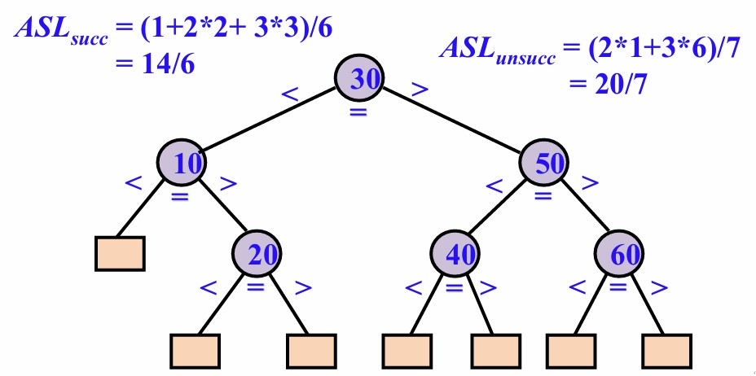

#### 8.1.1 Fibonacci查找

- 查找表大小为$n=fib(j)-1=fib(j-1)-1+fib(j-2)-1+1$
- 所以，当n不满足上述条件时，对n扩充到最小的$fib(j)-1$，同时保持有序性

```c++
int low = 1, high = fib(n)-1;
int mid, f1 = fib(n-1), f2 = fib(n-2);
while(low <= high){
	mid = low+f1-1;
    if(arr[mid] == key){
        return mid;
	}else if(key < arr[mid]){
        high = mid-1;
        f2 = f1-f2; // f2=fib(n-3)
        f1 = f1-f2; // f1=fib(n-2)
	}else if(key > arr[mid]){
        low = mid+1;
        f1 = f1-f2; // f1=fib(n-3)
        f2 = f2-f1; // f2=fib(n-4)
    }
}
return -1;
```

#### 8.1.2 插值查找

- 根据key值来决定与哪个记录比较 并分区
- $i=\frac{key-arr[l]}{arr[h]-arr[l]}(h-l+1)$，将key和arr[i]比较
- 适用于关键字分布均匀的情况

### 8.2 索引顺序查找/分块查找

- 将查找表分块
  - 块内无序，块间有序
  - 第i块的值**全部**小于第i+1块的值

- 在查找表的基础上附加一个索引表
  - 索引表有序
  - 索引表包含：块的极值（最大值），块的起始指针
- 用折半查找/顺序查找找到块，块内进行顺序查找

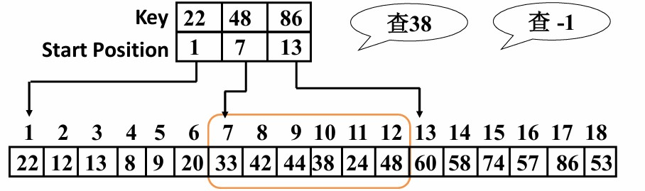

```c++
// 表长n，b个块
int i = 0, j;
while((i<b) && ind[i].maxkey<key){
    i++;
}
if(i >= b){
    return -1;
}
j = ind[i].startpos;
int end_pos = (i+1<b)?(ind[i+1].startpos):n;
while(j < end_pos){
    if(arr[j] == key){
        return j;
	}
    j++;
}
return -1;
```

- ASL
  - n个记录，均分为b块，每块s个记录，即块的查找概率$\frac{1}{b}$，块内查找概率$\frac{1}{s}$
  - $ASL = \frac{b+1}{2}+\frac{s+1}{2}$
  - $s=\sqrt n，ASL_{min}=\sqrt n+1$

### 8.3 静态树表/次优查找树的查找

- 构造次优查找树比构造最优查找树省时间
- 有点像huffman树，希望带权内路径长度之和尽可能小
  - $PH = \Sigma_{i=1}^nw_i\times h_i，h_i为层数（路径长度）$
- 现有有序序列$r_l,r_{l+1},...,r_h$，对应权值$w_l,w_{l+1},...,w_h$
  - 希望$\Delta P_i=|\Sigma_{j=i+1}^hw_j-\Sigma_{j=l}^{i-1}w_j|$最小，即从i划分，两侧划分的权值之差最小
  - 考虑前缀和优化，定义$sw_i=\Sigma_{j=l}^iw_j,\ sw_{l-1}=0$
  - 易得$\Delta P_i=|(sw_h-sw_i)-(sw_{i-1}-sw_{l-1})|$
- 代码实现思路：
  - 计算整个序列的前缀和sw
  - 对当前区间：
    - 枚举每个分割点i，找出使得$\Delta P_i$最小的i
    - 在i处建立一个树节点
    - 递归处理左区间和右区间，分别作为左子树和右子树
- 手算方法：
  - 列表计算sw和$\Delta P$
  - 根据$\Delta P$来建树
  - 根据树计算PH

### 8.4 二叉排序树

- 左子树节点全部小于根，右子树节点全部大于根
- 中序遍历得到一个有序序列
- ASL计算需要建出具体的树，根据树的形状计算
  - 一般的，对于n个元素的所有排列，期望$ASL=2\frac{n+1}{n}\log n+C$
- 查找和插入算法是显然的
- 删除需要讨论：
  - p为叶子，直接删
  - p有一棵子树，直接把子树接回父节点
  - p两棵子树，找中序前驱，互换位置，删p'（p'至多一棵子树）

```c++
struct treeNode{
    int data;
    treeNode *lc, *rc, *parent;
    treeNode(int key, treeNode *p): data(key), lc(NULL), rc(NULL), parent(p) {}
};
treeNode* searchBST(treeNode *root, int key){
    if(!root){
        return NULL;
    }
    if(root->data == key){
        return root;
    }else if(root->data > key){
        return searchBST(root->lc, key);
    }else{
        return searchBST(root->rc, key);
    }
}
treeNode* insertBST(treeNode *root, int key, treeNode *parent){
	if(!root){
        return (new treeNode(key, parent));
	}
    if(root->data == key){
        return root;
    }else if(root->data > key){
        root->lc = insertBST(root->lc, key, root);
        return root;
    }else{
        root->rc = insertBST(root->rc, key, root);
        return root;
    }
}
treeNode* deleteBST(treeNode *root, int key){
    if (!root) {
        return NULL; 
    }
    if(key < root->data){
        root->lc = deleteBST(root->lc, key);
        return root;
    }else if(key > root->data){
        root->rc = deleteBST(root->rc, key);
        return root;
    }else{
        if(!root->lc){
            treeNode *temp = root->rc;
            if(temp){
                temp->parent = root->parent; 
            }
            delete root;
            return temp;
        }else if(!root->rc){
            treeNode *temp = root->lc;
            if(temp){
                temp->parent = root->parent; 
            }
            delete root;
            return temp;
        }else{
            treeNode *pre = root->lc;
            while(pre->rc){
                pre = pre->rc;
            }
            root->data = pre->data;
            root->lc = deleteBST(root->lc, pre->data);
            return root;
        }
    }
}
```

### 8.5 AVL树/平衡二叉树

- BST plus
- 保持平衡，维护两侧子树深度之差bf
  - 左子树和右子树深度之差的绝对值不大于1
  - 左子树和右子树也都是平衡二叉树
- AVL通过旋转维护平衡（见下图）
  - 对于RR，将左上方的点向下旋转成为中间顶点的左子树
  - 对于LL，将右上方的点向下旋转成为中间顶点的右子树
  - 对于LR，先将下方两个顶点向左转，此时成为LL，右旋即可
  - 对于RL，先将下方两个顶点向右转，此时成为RR，左旋即可

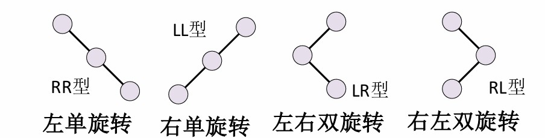

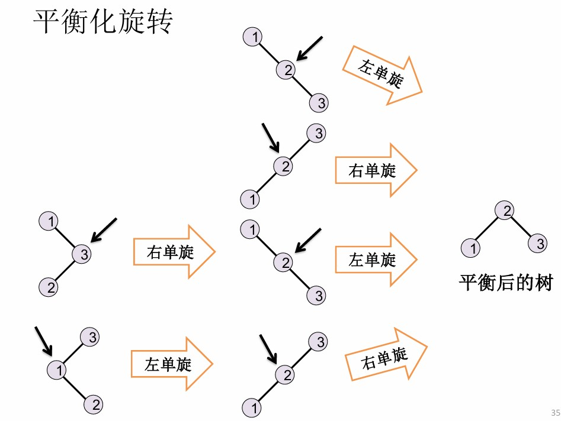

```c++
/**
 * @brief 求高度信息
 * 
 * @param idx 节点下标
 * @return int 高度信息
 */
static int getHeight(int idx){
    return idx ? tree[idx].height : 0;
}

/**
 * @brief 更新高度和平衡因子
 * 
 * @param idx 节点下标
 */
static void updateNode(int idx){
    if(idx){
        int lh = getHeight(tree[idx].left);
        int rh = getHeight(tree[idx].right);
        tree[idx].height = 1+max(lh, rh);
        tree[idx].bf = rh-lh; 
    }
    return;
}

/**
 * @brief 右旋
 * 
 * @param y 要右旋的不平衡的节点
 * @return int 旋转后的子树根
 */
static int rightRotate(int y){
    int x = tree[y].left;
    tree[y].left = tree[x].right;
    tree[x].right = y;
    
    updateNode(y);
    updateNode(x);
    return x;
}

/**
 * @brief 左旋
 * 
 * @param x 要左旋的不平衡的节点
 * @return int 旋转后的子树根
 */
static int leftRotate(int x){
    int y = tree[x].right;
    tree[x].right = tree[y].left;
    tree[y].left = x;
    
    updateNode(x);
    updateNode(y);
    return y;
}

/**
 * @brief 插入节点
 * 
 * @param idx 平衡树的根
 * @param key 插入的键值
 * @return int 平衡后的根
 */
static int insertNode(int idx, int key, bool& isInserted){
    if(!idx){
        isInserted = 1;
        return newNode(key);
    }
    if(key < tree[idx].key){
        int nextLeft = insertNode(tree[idx].left, key, isInserted);
        tree[idx].left = nextLeft;
    }else if(key > tree[idx].key){
        int nextRight = insertNode(tree[idx].right, key, isInserted);
        tree[idx].right = nextRight;
    }else{
        isInserted = 0;
        return idx;
    }

    updateNode(idx); // 更新插入后的节点信息

    if(tree[idx].bf < -1){ // 左侧更高
        if(tree[tree[idx].left].bf <= 0){
            return rightRotate(idx); // LL
        }else{
            int newLeft = leftRotate(tree[idx].left); // LR
            tree[idx].left = newLeft;
            return rightRotate(idx);
        }
    }
    if(tree[idx].bf > 1){ // 右侧更高
        if(tree[tree[idx].right].bf >= 0){
            return leftRotate(idx); // RR
        }else{
            int newRight = rightRotate(tree[idx].right); // RL
            tree[idx].right = newRight;
            return leftRotate(idx);
        }
    }

    return idx;
}
```

- 画图就是BST的建立+旋转平衡的过程

### 8.6 B树和B+树

- 平衡的多路查找树
- m阶B树满足：
  - 每个节点至多m棵子树
  - 根节点至少两棵子树
  - 内部节点至少$\lceil \frac{m}{2} \rceil$棵子树
  - 所有叶子在同一层
- 节点形式为`(n, A0, K1, A1, K2,..., Kn, An)`
  - n为键的个数
  - $K_i$为键，单调增
  - $A_i$为指针，保证：$A_{i-1}$的子树全部小于$K_i$，$A_i$的子树全部大于$K_i$

- m阶B树是高度平衡的m叉查找树
- 2阶B树是AVL树
- 树高满足$h\leq \log_{\lceil\frac{m}{2}\rceil}(\frac{n+1}{2})+1$
- B树的插入：
  - 从某个合适的叶子开始插入、
  - 如果叶子的键值到达m个，则开始分裂：
    - 将$K_{\lceil \frac{m}{2}\rceil}$送入父节点的合适位置，该键值两侧分裂为两个子节点挂载到父节点下

  - 递归检查父节点是否满足B树性质
  - 如果根节点不满足，则分裂，$K_{\lceil \frac{m}{2}\rceil}$成为新根，树高+1


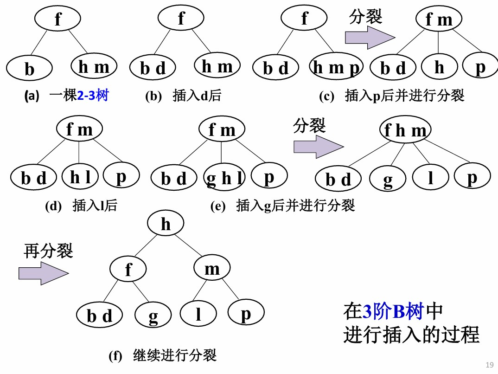

- B树的删除，若删除键值在节点N，删除其中的$K_i$
  - 若N不是叶子，则将$A_{i-1}$子树中的最大值（中序前驱）和$K_i$互换位置，此时需要处理的节点N变为叶子
  - 如果N的关键字个数$>\lceil \frac{m}{2}\rceil-1$
    - 直接删

  - 如果关键字个数$=\lceil \frac{m}{2}\rceil-1$，且**相邻**的兄弟关键字个数$>\lceil \frac{m}{2}\rceil-1$
    - 从相邻兄弟“借”一个紧挨的键值（左兄弟给最大值，右兄弟给最小值）
    - 该键值并入父节点
    - 将父节点中本来用以分割N以及其**借出键值的兄弟**的键值下移到N

  - 如果兄弟都没法借，需要合并
    - 将当前节点、它的一个兄弟节点，以及父节点中分隔这两个节点的那**一个中间关键字**，三者合并成一个新的单一节点
    - 合并后，新节点包含的关键字数量为 $(\lceil \frac{m}{2} \rceil - 1 - 1) + 1 + (\lceil \frac{m}{2} \rceil - 1) = 2 \lceil \frac{m}{2} \rceil - 3$。由于 $2 \lceil \frac{m}{2} \rceil - 3 \le m - 1$，这个新节点绝对不会超出B树的容量上限
      -  这一步会导致父节点失去了一个关键字和一个子节点指针，等效于父节点删了一个键值

    - 向上递归处理父节点
    - 如果根节点因合并导致没有关键字，则其唯一子节点为新根，树高-1


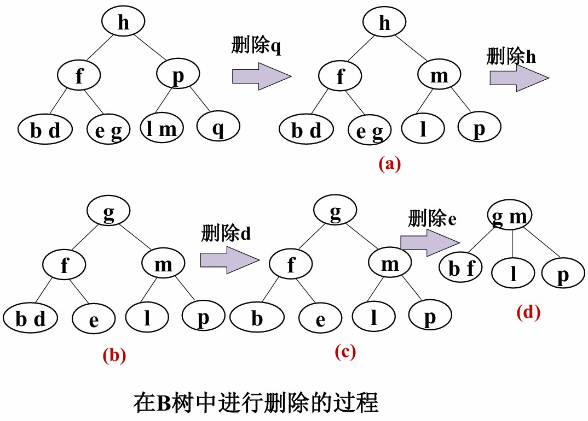

- B+树
  - 叶子包含全部关键字，且串成一个有序链表
  - 内部节点包含下层节点的最值，看作是分块查找中的“块索引”
  - 查找一定会从根走到叶子才会停止
  - 插入
    - 在叶子插入，大于m个键值则均分为两个节点，将两个节点的最值存入父节点
    - 递归向上处理

  - 删除
    - 在叶子删除
    - 小于$\lceil\frac{m}{2}\rceil$时，和兄弟合并


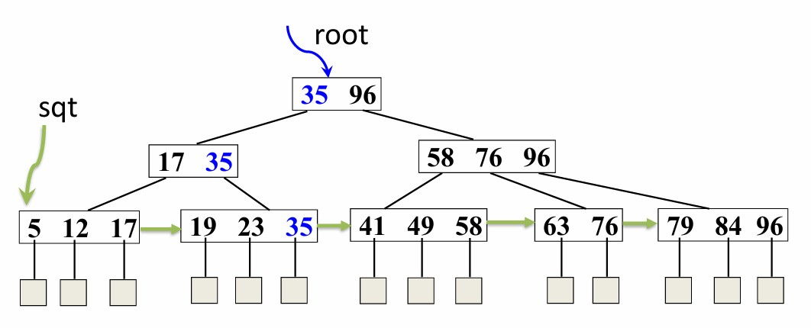

### 8.7 键树

- 节点包含符号，从根开始的路径可以表示不同的关键字
- 多叉树，和基的选择有关
- 一般的，键树使用孩子-兄弟链表存储
  - 对于双链树，最大度为d，树深h，$ASL=\frac{h}{2}(1+d)$

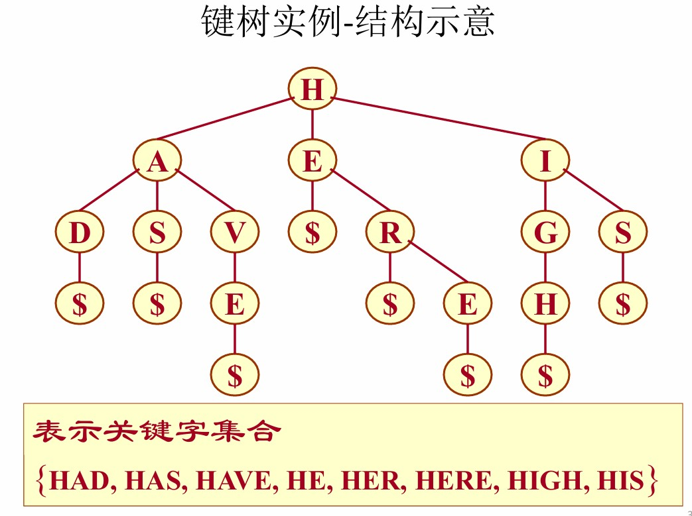

- Trie树/字典树
  - 使用多重链表实现
  - 26个字母，所以直接在每个节点定义26个指针域，分别代表一个字母即可
    - Trie树的字符存在**边**上，不在点上！
  - 插入
    - 逐个字符处理
    - 检索当前节点该字符是否有边，有则向下，否则新建节点
    - 处理最后一个字符后，在尾节点的cnt+1，统计出现次数
  - 查找、删除逻辑和插入完全一致

```c++
struct node{
    int nxt[26];
    int cnt;
    node(){
        memset(nxt, -1, sizeof(nxt));
        cnt = 0;
    }
};

void trie_insert(vector<node>& trie, const string& s){
    int p = 0;
    int len = s.length();
    for(int i=0; i<len; ++i){
        int u = s[i]-'a';
        if(trie[p].nxt[u] == -1){
            node tmp;
            trie.push_back(tmp);
            trie[p].nxt[u] = trie.size()-1;
        }
        p = trie[p].nxt[u];
    }
    trie[p].cnt++;
    return;
}

int trie_search(const vector<node>& trie, const string& s){
    int p = 0;
    int len = s.length();
    for(int i=0; i<len; ++i){
        int u = s[i]-'a';
        if(trie[p].nxt[u] == -1){
            return 0;
        }
        p = trie[p].nxt[u];
    }
    if(trie[p].cnt > 0){
        return p;
    }else{
        return 0;
    }
}

void trie_delete(vector<node>& trie, const string& s){
    int p = trie_search(trie, s);
    if(!p){
        return;
    }
    trie[p].cnt--;
    return;
}
```

### 8.8 哈希表

- 用一个函数将键值映射到一个整数，将这个整数直接作为键值存储的地址，O(1)查找
- 可能有哈希冲突，所以取出值之后需要比较是否一致
  - 哈希冲突：对于关键字$k_i \neq k_j$，但$H(k_i)=H(k_j)$
- 装填因子$\alpha=\frac{表中填入的记录数}{哈希表长度}$

#### 8.8.0 哈希函数构造

- 直接定址

  - $H(key) = a·key+b$
  - 不会冲突

- 数字分析

  - 若关键字为以r为基的数，取关键字的若干位或组合作为哈希地址

  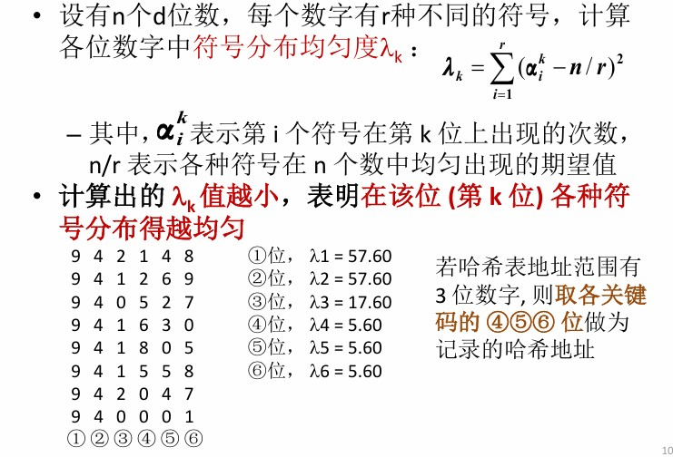

- 平方取中
  - 关键字平方之后，取中间的几位作为地址
- 折叠
  - 将关键字分割为位数相同的几部分，取叠加和为哈希值
  - 移位叠加：各部分平移叠加（低位对齐）
  - 间界叠加：来回折叠进行叠加
- 除留余数
  - $H(key)=key\ mod\ p$
  - p为质数，一般取$10007, 1e9+7$等
- 随机数
- 对于字符串求哈希：
  - 字符串考虑ASCII码有128种，取基$b=131$，模$p=10007或者1e9+7$
  - 对于$w=w_1w_2w_3...w_k，H(w)=(w_1*b^{k-1}+w_2*b^{k-2}+...+w_k*b^0)\ mod\ p$
  - 这种哈希函数可以用来做模式匹配

#### 8.8.1 冲突处理

- 开放定址
  - 根据规则，从冲突位置开始寻找，直到找到一个空地址，来存放数据
  - $H_0(key)=H(key),H_i(key)=(H(key)+d_i)\ mod\ m$
  - $d_i$为人为规定的增量序列
    - 线性探测法，$d_i=1,2,3,...,m-1$
    - 二次探测法：$d_i=1^2,-1^2,2^2,-2^2,...,k^2,-k^2$
      - 定理：当表长m是质数，且装填因子小于等于 0.5，可以找出空闲地址
      - 定理：表长 m 是形如4j+3的质数时，可以保证查找链的前m项均互异
    - 伪随机探测法
- 多哈希
  - 构造多个哈希函数
  - 逐个计算，直到发现不冲突的哈希值
- 链地址
  - 在冲突的哈希地址处建立子表，将所有冲突键值存在子表内
- 建立公共溢出区
  - 对于冲突的键值，直接插入溢出区的后续空闲位置
    - 在溢出区只能顺序查找

#### 8.8.2 ASL

- 线性探测
  - $S_{nl成功}\approx \frac{1}{2}\times (1+\frac{1}{1-\alpha})$
  - $U_{nl失败}\approx \frac{1}{2}\times (1+\frac{1}{(1-\alpha)^2})$
- 二次、伪随机、多哈希
  - $S_{nl成功}\approx -\frac{1}{\alpha}\times \ln(1-\alpha))$
  - $U_{nl失败}\approx \frac{1}{1-\alpha}$
- 链地址
  - $S_{nl成功}\approx 1+\frac{\alpha}{2}$
  - $U_{nl失败}\approx \alpha+e^{-\alpha}$

-------

## 9 内部排序

- 考虑算法复杂度=比较次数+移动次数
- 是否稳定，是否输入敏感

### 9.0 插入排序

#### 9.0.0 直接插入排序

- `r[1...i-1]`有序，`r[i...n]`无序
- 每次从后半段取出第一个数，插入到前半段合适的位置

```c++
for(int i=2; i<=n; ++i){
    if(r[i-1] <= r[i]){
        r[0] = r[i]; // 设置哨兵
        r[i] = r[i-1];
        int j;
        for(j=i-2; j>=0; --j){ 
            if(r[0] <= r[j]){
                break;
            }
            r[j+1] = r[j]; // 插入位置还在左侧，当前元素右移
        }
        r[j+1] = r[0];
    }
}
```

#### 9.0.1 折半插入排序

- 直接插入中，在前半段有序序列中用折半查找

```c++
for(int i=2; i<=n; ++i){
    r[0] = r[i];
    int low = 1, high = i-1;
    while(low <= high){
        int mid = (low+high)/2;
        if(r[0] > r[mid]){
            low = mid+1;
        }else{
            high = mid-1;
        }
	}
    for(int j=i-1; j>=high+1; --j){
        r[j+1] = r[j];
    }
    r[high+1] = r[0];
}
```

#### 9.0.2 2-路插入排序

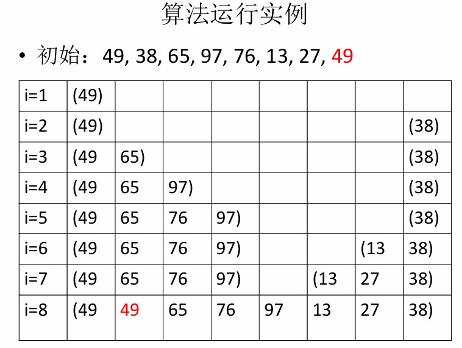

- 比哨兵大的，从前向后插入；比哨兵大的，从后向前插入
- 维护两个指针first和final，分别指向前后两个序列终止位置
- 整个序列看做一个循环向量，则从first到final是整体有序的

#### 9.0.3 表插入排序

- 在静态链表做插入排序，尽可能减少交换次数
- 排序结束后需重排数组来支持随机访问

```c++
struct node{
	int key;
    int nxt;
};
// 插入排序，最终r[0].nxt为序列起始，r[k].nxt==0为序列终止
r[0].key = INF;
r[0].nxt = 1, r[1].nxt = 0;
for(int i=2; i<=n; ++i){
    for(int j=0, k=r[0].nxt; r[k].key<=r[i].key; j=k,k=r[k].nxt){
        ;
    }
    r[j].nxt = i;
    r[i].nxt = k;
}

// 调整数组有序
p = r[0].nxt;
for(int i=1; i<n; ++i){
    while(p < i){ // 前i个元素一定有序，可以跳过
        p = r[p].nxt;
    }
    q = r[p].nxt;
    if(p != i){
        swap(r[p], r[i]);
        r[i].nxt = p; // r[i].nxt作为中转指回链表，避免断链
    }
    p = q; // p切换到链表中的下一个有序节点
}
```

#### 9.0.4 Shell排序

- 将序列以增量d分割为若干子序列，对每个子序列进行排序
  - 子序列内部排序可以用直接插入等方法
- 每一趟排序结束后，取新的d，重复排序
- 直到d=1，排序，则全局有序

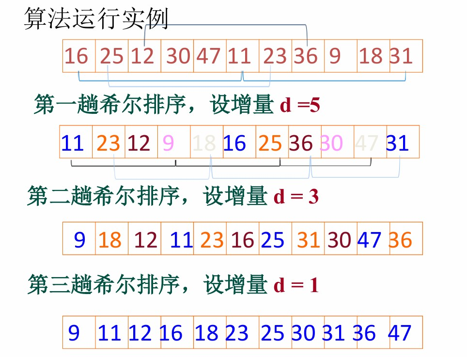

### 9.1 交换排序

- 俩水货，无需多言

#### 9.1.0 冒泡排序

```c++
for(int i=2; i<=n; ++i){
    int is_swapped = 0;
    for(int j=1; j<=n-i+1; ++j){
        if(r[j] > r[j+1]){
            swap(r[j], r[j+1]);
            is_swapped = 1;
        }
    }
    if(!is_swapped){
        break;
    }
}
```

#### 9.1.1 快速排序

```c++
void qsort(int l, int r){
    if(l >= r){
        return;
    }
	int pivot = arr[l];
    int idx = l;
    for(int i=l+1; i<=r; ++i){
        if(arr[i] <= pivot){
            swap(arr[i], arr[++idx]);
        }
    }
    swap(arr[l], arr[idx]);
    qsort(l, idx-1);
    qsort(idx+1, r);
    return;
}
```

- pivot取随机下标会更好

### 9.2 选择排序

#### 9.2.0 简单选择排序

- `r[1...i-1]`有序，`r[i...n]`无序
- 每次从后半段选择最小的那个，接在前半段的末尾

```c++
for(int i=1; i<n; ++i){
    int minn = INF, min_idx = -1;
    for(int j=i; j<=n; ++j){
        if(r[j] < minn){
            min_idx = j;
            minn = r[j];
        }
    }
    swap(r[min_idx], r[i]);
}
```

#### 9.2.1 树形选择排序

- 锦标赛排序，胜者树
- 整棵树的构造：
  - 叶子为待排序元素
  - 内部节点为比较结果，存储胜者编号
  - 根节点为最值的编号
- 每次从根节点取数追加到有序序列尾部，将树对应的叶子节点值改为INF，则新的根为次小编号

#### 9.2.2 堆排序

- 树结构（以大根堆为例）
  - 根的值一定大于左右孩子
  - 子树也如此递归定义
- 一棵完全二叉树，在数组中的下标满足（对于下标i的节点）：
  - 左孩子为2i，右孩子为2i+1
  - 父亲为$\lfloor\frac{i}{2}\rfloor$

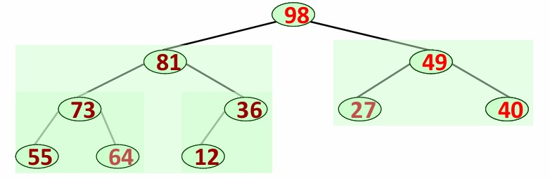

- 插入做up操作，向上处理；删除做down，向下操作

```c++
int heap[n];
void up(int p){
    while(p>1 && heap[p]>heap[p>>1]){ // 从当前叶子当根的路径，逐个比较并交换维护大根堆性质
        swap(heap[p], heap[p>>1]);
        p >>= 1;
    }
    return;
}
void down(int p, int n){
    int s = p<<1;
    while(s <= n){
        if(s<n && heap[s+1]>heap[s]){ // 选择左右孩子中更大的那一个
            s++; 
        }
        if(heap[s] > heap[p]){
            swap(heap[s], heap[p]);
            p = s;
            s = p<<1;
        }else{
            break; // 满足性质，不用再调整
        }
    }
    return;
}
void heap_sort(){
    for(int i=2; i<=n; ++i){
        up(i);
    }
    // 另一种建堆
    // for(int i=n/2; i>=1; --i){ // 只用调整非叶子
    //     down(i, n);
    // }
    for(int i=n; i>1; --i){
        swap(heap[1], heap[i]);
        down(1, i-1);
    }
    return;
}
```

### 9.3 归并排序

- 一般用2-路归并

```c++
void merge_sort(int l, int r){
	if (l >= r){
        return;
    }
    int mid = (l + r) >> 1; 
    merge_sort(l, mid);
    merge_sort(mid+1, r);

    int i = l; // 左半部分的起始指针
    int j = mid+1; // 右半部分的起始指针
    int k = l; // 临时数组 tmp 的存放指针
    while(i<=mid && j<=r){
        if(a[i] <= a[j]){
            tmp[k++] = a[i++];
        }else{
            tmp[k++] = a[j++];
        }
    }
    while(i <= mid){
        tmp[k++] = a[i++];
    }
    while(j <= r){
        tmp[k++] = a[j++];
    }
    for(int p = l; p<=r; ++p){
        a[p] = tmp[p];
    }
}
```

### 9.4 基数排序

- 借助多关键字排序来实现单关键字排序
  - MSD：$K^0$排序，每个$K^0$一样的部分作为子序列，对次要关键字排序
  - LSD：从最低优先级关键词排序，逐渐升高优先级（需要**稳定**的排序方式）
- 使用LSD实现基数排序（以整数为例）：
  - 从最低位开始，到最高位结束
  - 对于每一位，按照`0~9`建立子表，保持原有顺序**收集**相应的元素
  - 按照`0~9`的顺序，将10张子表连起来
  - 类似于“桶排序”

### 9.5 排序方法比较

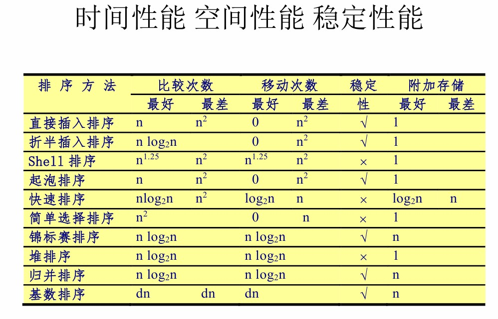

---------

## 10 外部排序

- 先分块进行内排序，得到初始归并段
- 对初始归并段进行归并排序，逐步合并，最后全局有序
- 运行方式：
  - 读入初始归并段，内部排序，输出初始归并段
  - 为k个初始归并段分配k个输入缓冲区，每个输入缓冲区一个指针指向当前参与排序的键值
  - 分配一个输出缓冲区
  - 每次从所有输入缓冲区中被指向的键值中选最小的那个，加入输出缓冲区，该输入缓冲区指针+1
  - 输出缓冲区满，输出到外存并清空
  - 输入缓冲区读完，清空，从归并段读入新数据
- 如何减少访存次数？
  - 增大路数k
  - 减少初始归并段个数m

### 10.0 k路归并

- m个初始归并段，则归并树高$\lceil\log_km\rceil+1$

- 引入败者树进行优化，内部归并时间退化为只和m,n相关

- 败者树工作方式如下图：

  - $k_3>k_4$，所以$k_3$输，在ls4记录败者段号3，$k_4$向上传递

  - 其余节点同样操作

  - ls0为冠军节点，不记录败者段号，记录最终胜者段号

  - 为什么节点维护败者段号？

    - 当05被取走，$k_1=44$
    - 只需要更新当前叶子到根这一条路径即可，不用维护整棵树
    - ls3与$k_2$比较，$k_2$胜出，ls3更新为1
    - ls1中$k_2$和$k_4$比较，最终ls0=2

    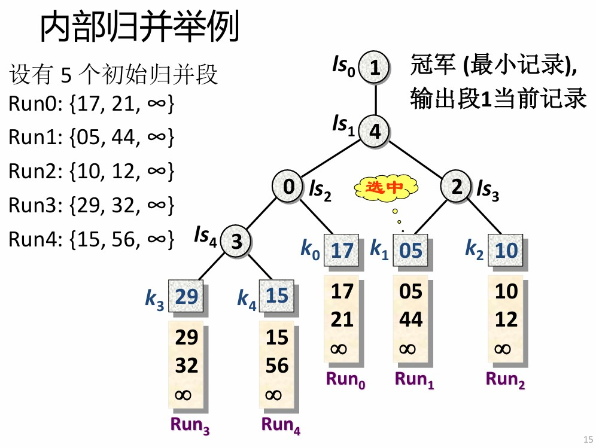

  - 如何创建败者树？

    - 初始化所有内部节点为k，默认第k+1段的值为$-\inf$
    - 逐个插入叶子，向上调整内部节点

### 10.1 置换-选择排序

- 减小m
- 用败者树生成初始归并段，可以生成平均比原来大一倍的初始归并段，从而减少初始归并段个数
- 运行过程（内存大小为k）：
  - 初始化：从输入文件FI读入k个记录到内存，构造败者树，全局段号（当前正在归并的段号）初始化为0，内存所有记录段号初始化为0
  - 构造归并段：选择最小的排序码放入输出文件FO，并将该排序码赋值给LastKey
    - 从FI读入下一个数据，全局段号赋值给该数据的段号，调整败者树
    - 败者树选择比LastKey大且最小的排序码，输出
    - 败者树比较逻辑
      - 段号小的为胜者
      - 段号一致则键值小的为胜者
    - 当冠军的值小于LastKey且段号等于全局段号，则将冠军的段号+1，表示这个元素应该在下一个段被归并，意味着这个冠军将被调整到败者树的中间节点去
  - 当败者树中的最小值也比LastKey小，FO写入外存作为一个归并段，全局段号+1
    - 当冠军的段号为全局段号+1时，意味着整棵败者树全部都是下一个归并段才处理的数据，即当前归并段处理完毕
  - 重复上述过程，直到FI和内存为空

### 10.2 最佳归并树

- 正则k叉树
  - 叶子为初始归并段
  - 叶子权值为初始归并段的记录个数
  - 根节点为最终归并段
  - 内部节点权值为归并过程中的记录个数
- 最佳归并树使得WPL最小，因为归并过程的读写总数为2*WPL
- 补充空归并段（权值为0），使得归并树为一棵正则树
  - 对于归并树有$n_0$个叶子，和$n_k=(n_0-1)/(k-1)$个度为k的内部节点
  - $(n_0-1)\%(k-1)=u$，补充$(k-u-1)\%(k-1)$个空段
- 类似huffman树的做法，权值小的先归并，权值大的后归并

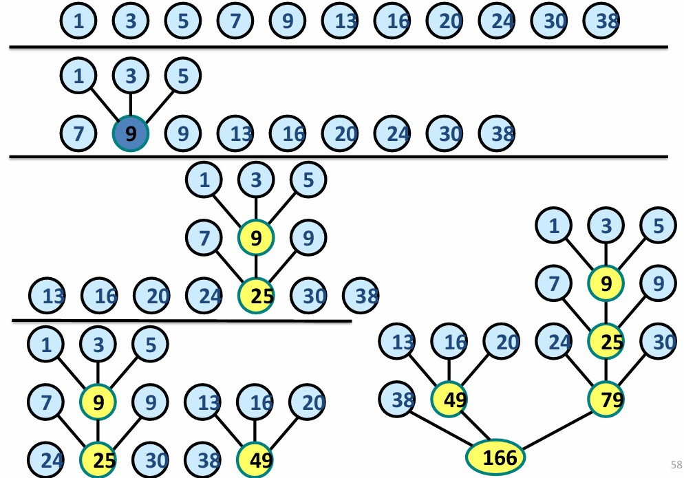
